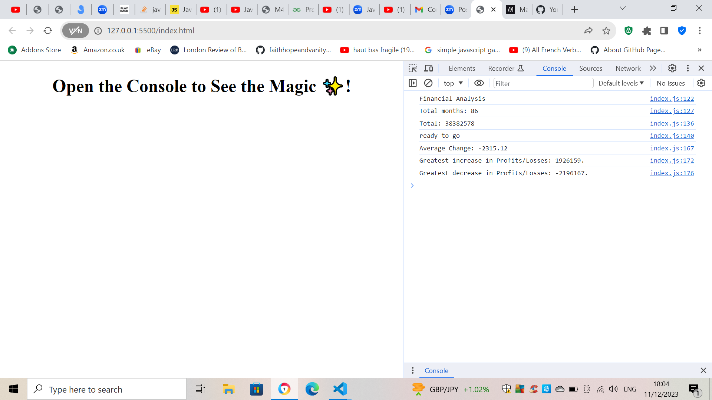

# Console-Finances

Unit 4 Challenge

In this challenge, I was tasked with using JavaScript to return data relating to financial statistics on a data sheet.

The provided array provided a company's monthly net profits over a period of time.

The first piece of code I had to write was to count how many months there are in the period provided. The array had the variable finances, so I just needed to write finances.length under a new variable to tell me the number of strings, which would give me the number of months as each string represented one month. Subsequently, I'd have to write code to find the total profit over the period, the average monthly change in profit/loss, and the greatest profit and greatest loss over the period.

This required the use of several for loops to create accumulation, and I had to be diligent when calculating the average monthly change in checking that I subtracted one from the number of months - as there were 86 months, so 85 monthly changes.

I also used Math.max and Math.min for the first time, to identify respectively the highest and lowest values in an array.

I wrote all of the code myself, but also received support from a TA in a 1:1 tutoring session, to rewrite my second for loop.

[Click here to access deployed application](https://faithhopeandvanity.github.io/Console-Finances)
